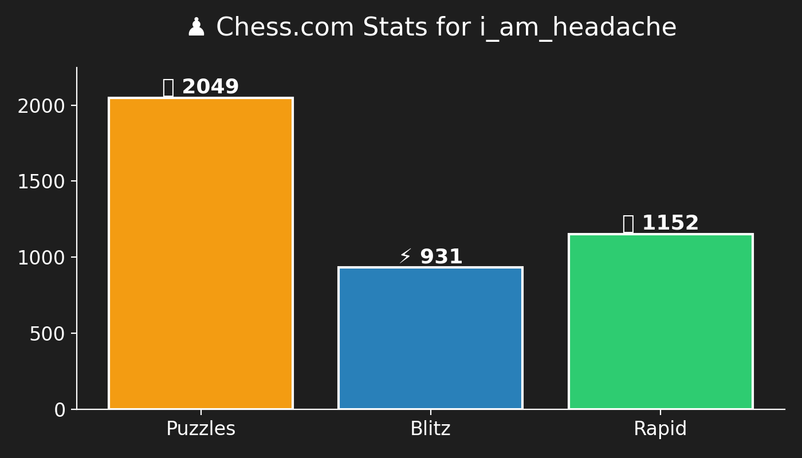

<h1 align="center">🌟 Hey there, I'm Mukul! 👋</h1>

<p align="center">
  
</p>

---

## 🧠 My Daily Routine in Python
```python
import datetime, random

def daily_routine():
    hour = datetime.datetime.now().hour
    moods = ["🔥 unstoppable", "🌄 sleepy", "🍕 hungry", "🧐 confused", "⚡ energetic", "🌈 inspired"]
    schedule = {
        (5, 8): "⏰ Snooze battles",
        (8, 12): "💻 Pretend to work (while procrastinating)",
        (12, 14): "🧠 Problem-solving sprints",
        (14, 18): "😴 Afternoon slump... power nap?",
        (18, 21): "🍽 Dinner and Netflix (or maybe chill)",
        (21, 24): "🧑‍💻 Late-night problem-solving mode",
        (0, 5): "🌌 Why are you still awake?!"
    }
    for (start, end), activity in schedule.items():
        if start <= hour < end:
            mood = random.choice(moods)
            return f"Right now: {activity} | Current mood: {mood}"

print(daily_routine())
```

---

## 📊 LeetCode Stats
<p align="center">
  
</p>

---

## ♟️ My Chess.com Stats
<p align="center">
  
</p>

---

## 🌐 Connect with me
<p align="center">
  <a href="https://linkedin.com/in/mukul-aggarwal-377562316/" target="_blank">
    
  </a>
  &nbsp;&nbsp;
  <a href="https://instagram.com/rotten_paintbrush" target="_blank">
    
  </a>
</p>